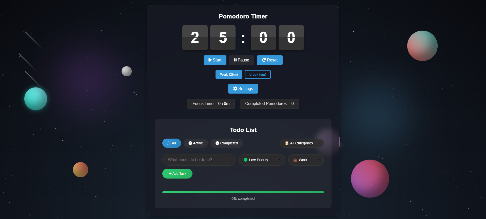

# 🚀 Pomodoro Timer & To-Do List App

A sleek and minimal productivity web app that combines the power of the **Pomodoro Technique** with an integrated **task manager**. Stay focused, organized, and in control of your time.

---

## 🧠 Features

### 🕒 Pomodoro Timer
- 25-minute work sessions
- 5-minute breaks
- Start, pause, and reset controls
- Tracks total focus time & number of completed Pomodoros

### ✅ To-Do List
- Add, filter, and categorize tasks
- Mark tasks as Active or Completed
- Set task priority (e.g., Low Priority)
- Task completion progress bar

### ⚙️ Settings
- Easily configurable for custom workflows
- Switch between **Work** and **Break** modes

---

## ✨ Tech Stack

- **Frontend**: HTML, CSS, JavaScript
- **Framework**: (if React/Vue/etc., add here)
- **Design**: Responsive with a space-themed UI

---

## 📸 UI Preview

